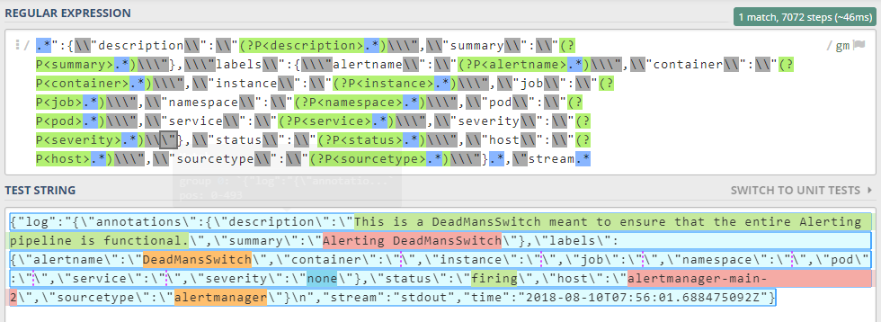
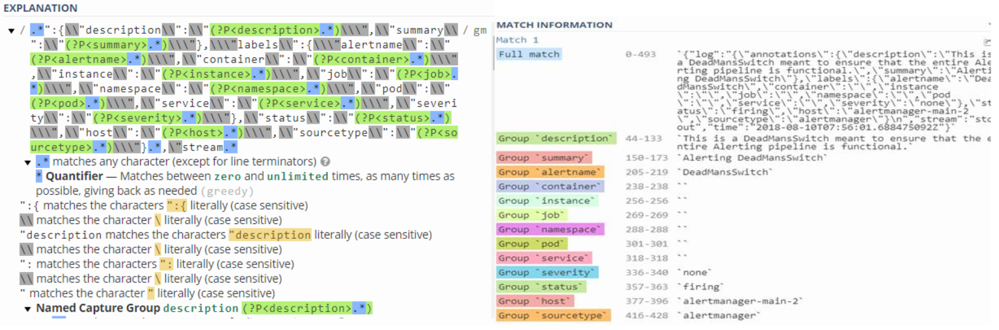

[:house:Home](https://github.com/debbiswal/Articles)

# Console Log stringification issue

We have an  Alertmanager Logger application   , which writes the alert details to console in docker. And these console outputs are directed to /var/log/container/myapi-splunk-webhook-deployment*.log file in our kubernetes cluster.  
Then , these logs are pushed to Splunk.  

The problem with these log entries is that , it is getting stringified and wrapped inside another Json(by k8s).  

Lets see the below example :  
```
{"log":"{\"annotations\":{\"description\":\"This is a DeadMansSwitch meant to ensure that the entire Alerting pipeline is functional.\",\"summary\":\"Alerting DeadMansSwitch\"},\"labels\":{\"alertname\":\"DeadMansSwitch\",\"container\":\"\",\"instance\":\"\",\"job\":\"\",\"namespace\":\"\",\"pod\":\"\",\"service\":\"\",\"severity\":\"none\"},\"status\":\"firing\",\"host\":\"alertmanager-main-2\",\"sourcetype\":\"alertmanager\"}\n","stream":"stdout","time":"2018-08-10T07:56:01.688475092Z"}
```

In the above example , the text in blue color(already stringified here , but we write simple valid json log) is the actual log , that we write to container console.  

But , k8s wraps it with the red color text and saves it in the /var/log/container/myapi-splunk-webhook-deployment*.log file.  

So , when we search in splunk , we found that the complete JSON is not fully parsed.  
By this  what I mean is , the value of ‘log’ field is treated as a simple string . And we don’t get a nested JSON here.  
So we were not able to search based on field names  like description , summary , alertname etc.  

To fix this , we have 3 solution :  
1)	Parse these stringified JSON before indexing in Splunk (not advisable)  
2)	Use Splunk heavy forwarder with regular expression to parse the data , before sending to Splunk server (bigger memory footprint, a tradeoff to decide)  
3)	Write custom field extractor and use it when required  

So , we went ahead with 3rd option and wrote a field extractor using Regular expression.  

Field extraction RegEx:  
```
.*":{\\"description\\":\\"(?P<description>.*)\\\",\\"summary\\":\\"(?P<summary>.*)\\\"},\\\"labels\\":{\\\"alertname\\":\\"(?P<alertname>.*)\\\",\\"container\\":\\"(?P<container>.*)\\\",\\"instance\\":\\"(?P<instance>.*)\\\",\\"job\\":\\"(?P<job>.*)\\\",\\"namespace\\":\\"(?P<namespace>.*)\\\",\\"pod\\":\\"(?P<pod>.*)\\\",\\"service\\":\\"(?P<service>.*)\\\",\\"severity\\":\\"(?P<severity>.*)\\\"},\\"status\\":\\"(?P<status>.*)\\\",\\"host\\":\\"(?P<host>.*)\\\",\\"sourcetype\\":\\"(?P<sourcetype>.*)\\\"}.*,\"stream.*
```

How to test ?  
Run the splunk query :  
index=myapi source="/var/log/containers/myapi-splunk-webhook-deployment*.log" sourcetype=myapi_k8s_ppe  
or
index=myapi source="/var/log/containers/myapi-splunk-webhook-deployment*.log" sourcetype=myapi_k8s_prod  

you can see the below fields are extracted  and listed in the Interesting Fields section.  

description , summary , alertname , container , instance , job , namespace , pod , service , severity , status , host , sourcetype   


You can test the regular expression on https://regex101.com/ and see how it works . Below are the screen shots:  
  
  

[:house:Home](https://github.com/debbiswal/Articles)
