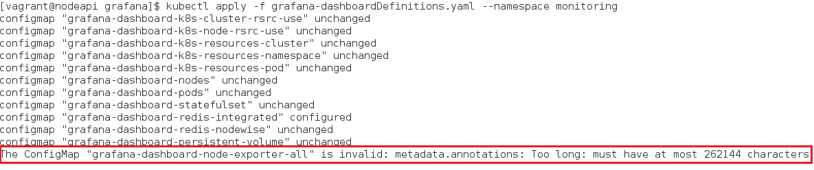
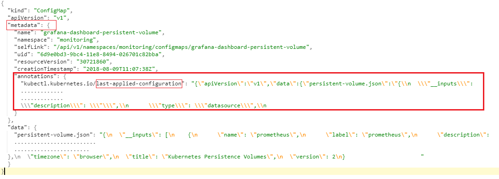

[:house:Home](https://github.com/debbiswal/Articles)

# Configmap Size Limit
Requirement : I have an existing Configmap , in which I have added a new configmap entry and reapplied to kubernetes.  

But I got an error . Below is the screen shot :  
  

I retired by  deleting the existing configmap and applying again.   
But got same problem.  

Upon investigating I found that Kubernetes has a size limit of 1MB for configmap.  
And my configmap entries exceeding that size.  

The issue lies with Imperative Management and Declarative Management approach.  

Lets see what Kubernetes documentation says :  

**Imperative Management Approach(kubectl create)** 
*When using imperative commands, a user operates directly on live objects in a cluster. The user provides operations to the kubectl command as arguments or flags.*  

This is the simplest way to get started or to run a one-off task in a cluster. Because this technique operates directly on live objects, it provides no history of previous configurations.  

**Declarative Management Approach (kubectl apply)**  
*When kubectl apply updates the live configuration for an object, it does so by sending a patch request to the API server. 
The patch defines updates scoped to specific fields of the live object configuration.*   

The kubectl apply command calculates this patch request using the configuration file, the live configuration, and the **last-applied-configuration** annotation stored in the live configuration .  

So , it means , when we use **‘kubectl apply’** command , the object configuration holds the last configuration details as a backup.  
This historical data is saved in **metadata.annotations.last-applied-configuration** in configuration object.  

See the below example , the **metadata.data** is almost replicated in **metadata.annotations.last-applied-configuration**:  
  

So , the configuration object is always double the size of actual data.  

But , when we use **‘kubectl create’** , the object configuration does not hold the data as backup in  **metadata.annotations.last-applied-configuration**  for future modification.  

You can see from below image , that the **metadata.annotations.last-applied-configuration** section is not there.  
    

So , the solution to my configmap size limitation is to use **‘kubectl create –f <file>’**  instead of  **‘kubectl apply –f <file>’**.
By this I am able to create the configmap with larger size.

Read the below link :  
[How apply calculates differences and merges changes](https://kubernetes.io/docs/concepts/overview/object-management-kubectl/declarative-config/#how-apply-calculates-differences-and-merges-changes)  
[Imperative Management of Kubernetes Objects Using Configuration Files](https://kubernetes.io/docs/concepts/overview/object-management-kubectl/imperative-config/)  
[Declarative Management of Kubernetes Objects Using Configuration Files](https://kubernetes.io/docs/concepts/overview/object-management-kubectl/declarative-config/)

Happy Learning :smiley:  

[:house:Home](https://github.com/debbiswal/Articles)
