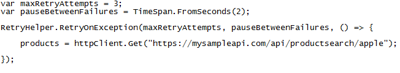

[Home](https://debbiswal.github.io/Articles) \| [Back](https://debbiswal.github.io/Articles/#api-gateway)

# Transient Fault - I #  

I my [previous article](../Art-1/apigateway_replaceby_functionality.html) , I discussed basics about Monolith Service , Microservice, API Gateway and Replace-by feature of it.  
Today , I will talk about Transient fault and how API Gateway handles it. 

This fault handling mechanism can be implemented at any place(not only API Gateway) , where ever you feel it is required as per the need.  

So lets START…..  

**What is Transient ?**    
As per Cambridge dictionary: It is something that last for short time , temporary.

**So ..What is Transient fault?**  
Lets understand this with one example :
Suppose an user is trying to search for some products on a retail website like Amazon,Flipkart etc.  

When user gave a search text and clicked the search button , the retail website tried to connect to PRODUCT_SEARCH service to get the data.  

But due to some problem search result is not displayed.  
User tried again , and this time he got the search result.  

**So , what happened first time , and why it worked second time?**  
As the user is able to get the result , it means PRODUCT_SEARCH service is working fine and the issue is somewhere else.You might have faced this at some point of time.  

These kind of failures are known as Transient Failures. These failures are temporary and many times goes off in second or third try.These failures are irregular and unpredictable.  

What could be the reason for Transient Failures?  
The most common reasons are :  
* Network issue : Application was not able to communicate service . It means service call did not reach to service. Or Service is not able to connect to DB to get the result due to DB connection issue.  
* Server Overload : Here service call reached to Service Host(IIS , Apache etc…) , but the Host is already overloaded(many pending request to process) , so Service Host could not serve the request.  
* (……there could be many more)  

**What is the Solution for this ?**  
* We can leave it to the user for retrying(don’t say this , my Manager will eat my Job)  
* Application will implement some logic to retry for some time to get the result(yah.. I will get a pat on my shoulder)  

The Application can implement RETRY PATTERN to resolve this issue…  

**What is Retry Pattern ?**  
The Retry pattern allows to retry some action if any transient failure happens.  
  

**Identifying Transient Faults**  
Before we start talking about how to handle the transient failures, the first thing is to identify the transient faults. 
The way to do that is to :
* Check if the fault is something that the target service is sending and actually has some context from the application perspective. If this is the case then we know that this is not a transient fault since the service is sending us a fault.  
*For example : if the service call fails due to some authentication failure , then there is no point of retrying*
* But if we are getting a fault that is not coming from the service and perhaps coming from some other reasons like infrastructure issues and the fault appears to be something that can be resolved by simply the calling service again, then we can say that it as a transient fault.

**Implementing Retry logic**  
Once we have identified the fault as a transient fault, we need to put some retry logic so that the issue will get resolved simply by calling the service again. 
The typical way to implement the retry is as follows:  
* Identify if the fault is a transient fault.  
* Define the maximum retry count.  
* Retry the service call and increment the retry count.  
* If the calls succeeds, return the result to the caller.  
* If we are still getting the same fault, keep retrying until the maximum retry count is reached.  
* If the call is failing even after maximum retries, let the caller module know that the target service is unavailable.  

Here it goes(screen shot of sample program ) :  
  
  

In the above sample program I am trying to call an api productsearch to search for apple.  
Assuming some transient fault will happen , and our retry logic will execute.  
I have not shown the implementation of IsTransientFault method , as it depends on .. what is transient for your application.  

**Problem with Simple Retry logic**  
Let's imagine a scenario where the transient fault is happening because the service is overloaded in peak hour or some throttling(limiting the number of calls to be served per second by the service) is implemented at the service end.  

This service is rejecting new calls. This is a transient fault as if we call the service after some time, our call could succeed.  

There is a possibility that our retry requests are further adding to the overload of the busy service, which mean the service will be in the overloaded state for more time and will take longer time to recover from this state.  

So in a way, our requests are contributing further to the reason of the fault. Ultimately, it's our application only that is suffering due to the longer recovery time of the service.  

So what to do ?  
Here comes a variant of Retry pattern… Retry with Exponential Backoff pattern  

**Retry with Exponential Backoff pattern**  
The idea behind using exponential backoff with retry is that instead of retrying after waiting for a fixed amount of time, we increase the waiting time between retries after each retry failure.  

For example, when the request fails the first time, we retry after one second. If it fails for the second time, we wait for 2 seconds before next retry.  

If the second retry fails, we wait for four seconds before next retry. So we are incrementally increasing the wait time between the consecutive retry requests after each failure.  

This gives the service some breathing time so that if the fault is due to service overload, it could get resolved faster.  

So with exponential backoff, our retry algorithm will look like following:  
* Identify if the fault is a transient fault.  
* Define the maximum retry count.
* Retry the service call and increment the retry count.
* If the calls succeeds, return the result to the caller.
* If we are still getting the same fault, Increase the delay period for next retry.
* Keep retrying and keep increasing the delay period until the maximum retry count is hit.
* If the call is failing even after maximum retries, let the caller module know that the target service is unavailable.

Lets imagine that , we have implement the exponential backoff logic , and there is network issue which will take 5 hours to recover(as communicated by Network team).This type of fault is known as Long-lasting Transient Fault.  

The problem with long-lasting transient faults is that our application will end up retrying, waiting and retrying till the maximum retry count is hit and thus wasting resources.  

So we should have some mechanism to identify long-lasting transient faults and let this retry mechanism not come into play when we have identified the fault as long-lasting transient fault.  

We will discuss about the solution for this in next article.  

References :  
* Microsoft Transient Fault library : https://msdn.microsoft.com/en-us/library/dn440719(v=pandp.60).aspx  
* IDBExecutionStrategy , DBExecutionStrategy in MS Entity Framework  
* Strategy Pattern  

Happy Learning :)

[Home](https://debbiswal.github.io/Articles) \| [Back](https://debbiswal.github.io/Articles/#api-gateway)
