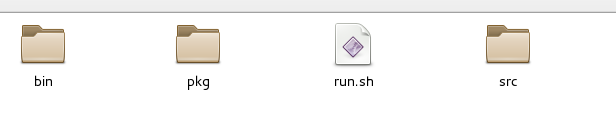
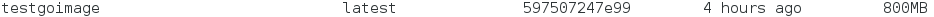

[Home](https://debbiswal.github.io/Articles/) \| [Back](https://debbiswal.github.io/Articles/#docker)  

# Multi-stage Docker Building  

### Problem statement :  

I have a GO program(inside App folder) with the following folder structure  

Contents of App folder on local machine :  
  

Now , I want to create a docker image for this.  

### Solution
* Build the code on local machine to get the binaries  
* Create a new image based on golang docker image from docker hub  
* Copy paste the binaries from local machine to docker image  

*Dockerfile :*  
  

*Build :*
```
$ docker build –t testgoimage
```  

*List the docker image :*
```
$ docker images
```  

  

**But , what I see is , for my minimal program , the docker image size is 800MB.**  
The reason is , by default the golang image size if around 800MB.

So , I need to optimize the image size.

*How ?*  
Here comes the Multi-Stage build in docker

*So What is Multi-Stage build ?*  
Multi-stage build is a feature , which is available from Docker 17.05 version.
Using this feature , we can optimize the docker image size.

*For Upgrading Docker CE*  
* For CENTOS  follow the link : https://docs.docker.com/install/linux/docker-ce/centos/

**Solution**  
* Create a new image based on golang docker image from docker hub  
* Copy paste the code from local machine to container  
* Build the code inside container , to generate the binaries  
* Create a new image(within same Dockerfile) from alpine  
* Create folder structure as required in alpine image  
* Copy binaries from golang image to alpine image  

Dockerfile :  
  

Build :  
```
$ docker build –t testalpinego . (this step will create two image , testalpinego and a <none> one)
```  

Now we need to remove the dangling image(<none>) , which is not required any more(the appbuilder image).  
```
$ docker images --quiet --filter=dangling=true | xargs --no-run-if-empty docker rmi -f
```  

Docker images :  
```
$ docker images
```  
  

BINGO….  

You can see from the above image that testalpinego(10.6MB) image size is very very less as compared to testgoimage(800MB).  

*NOTE : All applications may not work properly in Alpine due to library dependencies. As Alpine uses musl library instead of glibc . So you have to test the app properly in alpine container.*  


Happy Learning :)  

[Home](https://debbiswal.github.io/Articles/) \| [Back](https://debbiswal.github.io/Articles/#docker)  
