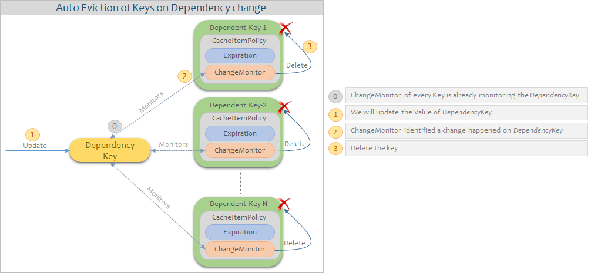

[:house: Home](https://github.com/debbiswal/Articles)

# InMemory Cache Flushing

Hi ,

Today I will discuss about key eviction in in-memory-cache in .NET .  

We normally use MemoryCache object to cache the data in memory for faster retrieval in WebApplication/API hosted in IIS.  
But sometimes we need to remove these all/partial cached data.  

**So how to clear the cache?**  
* *Solution 1* : MemoryCache is not providing any method like Clear() , which will remove all the keys.   
So .. we have to loop through all the keys to remove from cache.  
This is a heavy operation , as it will block the thread , resulting increase in response time.  

* *Solution 2* :One easiest solution to remove the in-memory cache , is to do the AppPool recycle.
AppPool recycle will clear all the memory associated with the WebApplication/API process and starts a new worker process in IIS to serve the request.

But :
What if we want to remove/flush some set of keys. ?  
What if we want to avoid the implications of AppPool recycle ?  
Or .. simply I don’t want to recycle the apppool for the sake of clearing some unwanted cache?  

**Solution :**  
.Net 4.0 provides a mechanism which is known as ChangeMonitor.  
We can save Key/Value pairs in Cache which are internally dependent on another master key (DependencyKey).  
This dependency is monitored by a ChangeMonitor object , which is associated with Key/Value pair and DependencyKey.  

When we want to delete all these Key/Value pairs , we will simply modify the value of Master key(DependencyKey).  
ChangeMonitors monitoring the DependencyKey will be intimated with information that DependencyKey has been modified.  
Hence all those keys , which are dependent on DependencyKey will be deleted automatically.  

**Key creation:**  
  

**Auto Eviction**  
  

**Code Snippet :**  
  

Note that , DependencyKey has to be present in Cache , before adding any other dependent key to Cache. Else these dependent keys will not be added to Cache.

The above code snippet was a sample one , which can be improvised as per need.

**A simple usecase :**  

While creating Key/Value pair , we can logically group them(known as Region) by relating to a Dependency Key.  
By this we will be able to create different regions in cache.  

We can provide a simple endpoint in API , say ClearAllCache() , which will call the InvalidateCache() method and clears the in-memory cache .  

We can also provide another endpoint ClearRegionCache() , which will take the Region/Dependency name as parameter , and Invalidate the corresponding DependencyKey to remove all the keys related to that group/region.  

The below diagram shows a sample Product API which manages two cache regions ProductDetail and ProductPrice.  
ProductDetail region is dependent on ProdDtl_DKEY DependencyKey.  
ProductPrice region is dependent on ProdPrice_DKEY DependencyKey.  

Consumer will call ClearRegionCache() to delete the corresponding region cache.  
Example :  
* ClearRegionCache(“ProdDtl_DKEY”) - > Clear all cache related to ProductDetail region
* ClearRegionCache(“ProdPrice_DKEY”) - > Clear all cache related to ProductDetail region

 

Happy Learning :)
