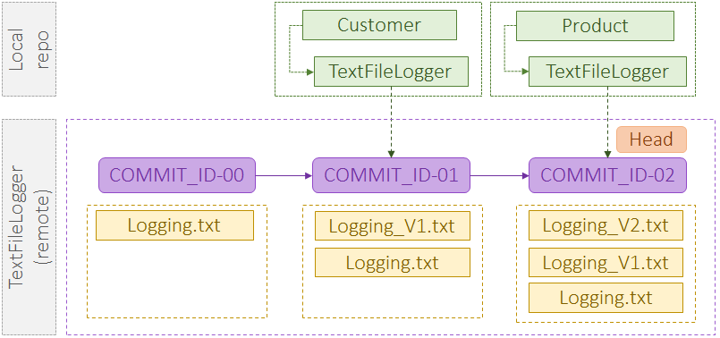
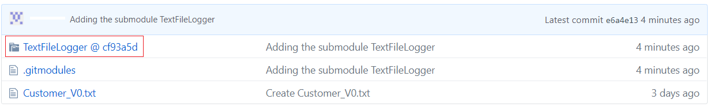
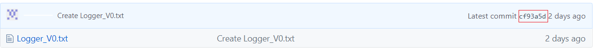

[Home](https://debbiswal.github.io/Tech-BITE/) \| [Back](https://debbiswal.github.io/Tech-BITE/#git)  

## Git Submodules - I 

What is a Submodule?  
A submodule is an external git repository , which we refer and use in our repository as a sub-repository.  

In simple terms , git submodules are shared libraries or plugins , which we use in our project , by refering them  to reuse the existing code.  

These sub modules exists as an independent repo within our main(parent) repo.  
As submodules are independent repo on its own ,we also can modify and commit changes to these submodules.  

Lets start with an example :  
Say , I have a repository *Customer* and *Product*.  
Also , I have a repo *TextFileLogger* and *DBLogger*.  

Now , I want to reuse the *TextFileLogger* in my *Customer* and  *Product* repo.  
For this , I can copy the contents of *TextFileLogger* and paste it inside my *Customer* and  *Product* repo.  

But , with this approach I will not be able to track the changes made to *TextFileLogger*.  
Every time , I need to check for updates happning on *TextFileLogger* and copy paste them in my *Customer* and  *Product* repo , which is cumbersome.  

So in summary , the problems with this approach are:  

* The original reference is lost. When we copy and paste code, there’s no reference back to the original spot where the code was found .  

* Updates aren’t easily integrated. When changes are made to the original code we copied, it becomes very hard to track what’s changed so we can apply those changes back to our cut and pasted code. Some third party libraries can have thousands of lines of code, spread across hundreds of files, and it’s impossible to keep things synchronized manually.  

* Version information isn’t maintained. When we copy and paste code, there’s no easy way to know we are using version 1.0.0 of library *TextFileLogger*  and how will we remember to update our code when version 1.0.1 is released?

The simplest solution , is to refer *TextFileLogger* repo from our repo. And pull/fetch the *TextFileLogger* repo when-ever required.

Now , say there are some changes happend to *TextFileLogger* :  
* change-1 : a new file LOGGING_V1.txt is added with commit id - COMMIT-ID-01
* change-2 : a new file LOGGING_V2.txt is added with commit id - COMMIT-ID-02

We will upgrade the *TextFileLogger* in *Product* repo , to COMMIT-ID-02.  
But *Customer* repo will only be able to use the COMMIT-ID-01 , due to some backward compatibility of other modules inside it.  

This kind of facility makes use of submodules simpler , as we can refer to different commit state in our different projects/repositories.  

  

Lets start with creating the required repositories :  

Create TextFileLogger repo with some dummy content :  
```bash
# Create a Github remote repository from CLI
curl -u 'debbiswal' https://api.github.com/user/repos -d "{\"name\":\"TextFileLogger\"}"

#Create the local repo TextFileLogger
mkdir TextFileLogger
cd TextFileLogger
git init
echo "TextLogger_V0" > TextLogger_V0.txt
git add TextLogger_V0.txt
git commit -m "added TextLogger_V0.txt"

#Now link the local repo with remote
git remote add origin https://github.com/debbiswal/TextFileLogger.git

# Check the remote links
git remote -v
Output :
origin	https://github.com/debbiswal/TextFileLogger.git (fetch)
origin	https://github.com/debbiswal/TextFileLogger.git (push)


#Now push the local repo data to remote
git push -u origin master

# For subsequent push , we dont have to use the' -u origin master' argument
echo "TextLogger Updated-1" > TextLogger_V0.txt

git add TextLogger_V0.txt
git commit -m "added TextLogger_V0.txt"
OR
git commit -am "added TextLogger_V0.txt"

git push
```  
In the similar way lets create the below repositories :  
* DBogger  with a fie DBLogger_V0.txt
* Customer with a file Customer_V0.txt
* Product with a file Product_V0.txt

So Now we have all our repositories ready.
Lets use the TextFileLogger repo in Customer and Product repos and submodule.  

### Adding Submodules
Lets add the *TextFileLogger* as submodule to *Customer* repo
```bash
# Get into Customer repo folder
$ cd Customer

# Add the TextFileLogger as a submodule
[Customer]$ git submodule add https://github.com/debbiswal/TextFileLogger.git
# Output
Cloning into 'Customer/TextFileLogger'...
remote: Enumerating objects: 3, done.
remote: Counting objects: 100% (3/3), done.
remote: Total 3 (delta 0), reused 0 (delta 0), pack-reused 0
Unpacking objects: 100% (3/3), done.
```  

Now , if we check the Customer folder .. we can see that TextFileLogger folder is created with all the contents.  
```bash
[Customer]$ ls
Output :
Customer_V0.txt  TextFileLogger

[Customer]$ ls TextFileLogger
Output :
Logger_V0.txt

# If tree command is not installed , then you have to install it.
# As my ststem is CENTOS , I have used the command 'sudo yum -y install tree'
[Customer]$ tree
Output :
.
├── Customer_V0.txt
└── TextFileLogger
    └── Logger_V0.txt

```

Adding submodule , added some settings in our local configuration of *Customer* repo:  
Lets check the *config* file under *.git* folder.  
```bash
[Customer]$ cat .git/config
Output :
[core]
	repositoryformatversion = 0
	filemode = true
	bare = false
	logallrefupdates = true
[remote "origin"]
	url = https://github.com/debbiswal/Customer.git
	fetch = +refs/heads/*:refs/remotes/origin/*
[branch "master"]
	remote = origin
	merge = refs/heads/master
[submodule "TextFileLogger"]
	url = https://github.com/debbiswal/TextFileLogger.git
	active = true
```
We can see that a **'[submodule "TextFileLogger"]'** section has been added to .git/config file.  

Now , lets check the status of our *Customer* repo.
```bash
[Customer]$ git status
Output :
On branch master
Your branch is up to date with 'origin/master'.

Changes to be committed:
  (use "git reset HEAD <file>..." to unstage)

	new file:   .gitmodules
	new file:   TextFileLogger
```  
We can see that , it also staged two files (.gitmodules , TextFileLogger)  

But what is this **.gitmodules** file ?  
Lets print the contents of *.gitmodules* file from *Customer* repo :  
```bash
[Customer]$ cat .gitmodules 
Output :
[submodule "TextFileLogger"]
	path = TextFileLogger
	url = https://github.com/debbiswal/TextFileLogger.git
```

This is similar to **'[submodule "TextFileLogger"]'** section in .git/config file .  

**So why the duplication ?**  
Its because our local config(.git/config) resides on our local machine .  

And other contributors to *Customer* repo does not have any clue that which submodule has been added .  
So , they need some information about , which submodules they have to setup in their own repo(after cloning Customer repo on their system).   

This is what .gitmodules is for.

We will see verry soon that how other contributors will use this *.gitsubmodules* file , to setup sobmodules in their repo.  

Now , lets come back to our *Customer* repo.  
If you have noticed **git status** command output , we saw that two files (.gitsubmodules,TextFileLogger) has been added.  

But , *TextFileLogger* repo , is added to our *Customer* repo as subrepo.
So any changes made to *TextFileLogger* repo should be visible to us.
But we did not see , any information related to *TextFileLogger* repo.

So , how do we see those information about chnages made to subrepos?
Status, like logs and diffs, is limited to the active repo , not to submodules, which are nested repos. 
So we need to set up a submodule-aware status for the repo OR globally:

```bash
# Check the repo level submoduleSummary config 
[Customer] $ git config status.submoduleSummary
# Output :
false

# Check the global level submoduleSummary config 
[Customer] $ git config --global status.submoduleSummary
# Output :
false

# We can set the submoduleSummary config repo level OR global level(for all repos)

# Set status.submoduleSummary to true  , repo level
[Customer] $ git config status.submoduleSummary true

# OR

# Set status.submoduleSummary to true  , global level(for all repos)
[Customer] $ git config --global status.submoduleSummary true
```

Lets try again **git status** command again :  
```bash
[Customer]$ git status
Output :
On branch master
Your branch is up to date with 'origin/master'.

Changes to be committed:
  (use "git reset HEAD <file>..." to unstage)

	new file:   .gitmodules
	new file:   TextFileLogger

Submodule changes to be committed:

* TextFileLogger 0000000...cf93a5d (1):
  > Create Logger_V0.txt
```
Now you see , we got the status related to submodule *TextFileLogger* also.  It says, that it has 1 commit made. 
The last commit was an addition(right angle bracket , >) and the last commit meesage was 'Create Logger_V0.txt' .

So , whats the status of our submodule.
Lets check :
```bash
[Customer]$ cd TextFileLogger/
[Customer/TextFileLogger]$ git status
Output :
On branch master
Your branch is up to date with 'origin/master'.

nothing to commit, working tree clean
```
In the above example , we saw that , the status is only shown for the TextFileLogger submodule repo.
Its because of a new *.git* file takes over the responsibilities.
Yes , there is a file *.git* exists in the directory.

Lets see the contents of the *.git* file :
```bash
[Customer/TextFileLogger]$ cat .git
Output :
gitdir: ../.git/modules/TextFileLogger
```  

Git does not leave submodule repo directories inside the main repo’s working directory, but keep these in the main repo's .git directory (inside .git/modules), and uses a *gitdir* reference in submodules.

Lets check the Customer/.git/modules folder :  

```bash
[Customer/TextFileLogger]$ cd ..
[Customer]$ cd .git/modules/
[Customer/.git/modules]$ ls
Output :
TextFileLogger
[Customer/.git/modules]$ cd TextFileLogger/
[Customer/.git/modules/TextFileLogger]$ ls
Output :
branches  config  description  HEAD  hooks  index  info  logs  objects  packed-refs  refs
```
We can see here that , there is a folder *TextFileLogger* . And it has all ncessary files & folders to represent the *TextFileLogger* repo.  

Now  , Lets push the changes :  
```bash
[Customer/.git/modules/TextFileLogger]$ cd ../../..
[Customer]$ git commit -m "Adding the submodule TextFileLogger"
Outpput :
[master e6a4e13] Adding the submodule TextFileLogger
 2 files changed, 4 insertions(+)
 create mode 100644 .gitmodules
 create mode 160000 TextFileLogger

[Customer]$ git push
```
Now if we see the repository in github website , we can see that the *TextFileLogger* is saved as a reference with specific commit id.  
There is no physical folder exists for *TextFileLogger* inside *Customer* repo.  

See the below pic :  
  

If we click the *TextFileLogger* link in *Customer* repo , we will be redirected to *TextFileLogger* repo with specific commit id.  

See the below pic :  
  

But do remember that , the information about submodules  , which was added to .git/config file  , never pushed to remote.  

Submodules information is only saved in .gitmodules file , which is pushed to remote.  
We will discuss these things in next section.  

### Cloning a repo with submodule
Till now , we have created a repo and added a submodule to it.  
Now , lets try to clone the repo into a different folder , and see whether we are getting back the submodules or not.  

Clone the Customer repo into a different folder
```bash
# Clone the Customer repo into another folder .. say CustomerClone
$ git clone https://github.com/debbiswal/Customer.git CustomerClone
Output :
Cloning into 'CustomerClone'...
remote: Enumerating objects: 11, done.
remote: Counting objects: 100% (11/11), done.
remote: Compressing objects: 100% (6/6), done.
remote: Total 11 (delta 0), reused 3 (delta 0), pack-reused 0
Unpacking objects: 100% (11/11), done.

# Get inside the folder
$ cd CustomerClone

# Print the folder structure
[CustomerClone]$ tree
Output :
.
├── Customer_V0.txt
└── TextFileLogger

1 directory, 1 file
```  
We can see here that , only *TextFileLogger* folder is created , but its empty. There should be a file Logger_V0.txt. Which is missing.

As we can see from the output of *git clone* command , it was successfully executed , so there is no chance that clone is failed for any reason.  

So , there could be a possibility that , Customer repo does not have information about its submodules .
And thats why while cloning , submodules did not get cloned.

Lets verify.. whatever I have told ..
```bash
[CustomerClone]$ cat .git/config
Output :
[core]
	repositoryformatversion = 0
	filemode = true
	bare = false
	logallrefupdates = true
[remote "origin"]
	url = https://github.com/debbiswal/Customer.git
	fetch = +refs/heads/*:refs/remotes/origin/*
[branch "master"]
	remote = origin
	merge = refs/heads/master
```
We can see here that , the repo CustomerClone does not have the submodule information in its local configuration.

So , whether .gitmodules file has the information ?
```bash
[CustomerClone]$ cat .gitmodules
Output :
[submodule "TextFileLogger"]
	path = TextFileLogger
	url = https://github.com/debbiswal/TextFileLogger.git
```
Yes it has.

**So ,How do we get the *TextFileLogger* submodule added to our *CustometClone* repo?**
* First we have to update the *CustomerClone* repo's local configuration with *TextFileLogger* submodule information
```bash
# Update/Initialize submodule information in local configuration
[CustomerClone]$ git submodule init
Output :
Submodule 'TextFileLogger' (https://github.com/debbiswal/TextFileLogger.git) registered for path 'TextFileLogger'
```

Lets verify , whether local configuration has been updated with submodule information or not :
```bash
[CustomerClone]$ cat .git/config
Output :
[core]
	repositoryformatversion = 0
	filemode = true
	bare = false
	logallrefupdates = true
[remote "origin"]
	url = https://github.com/debbiswal/Customer.git
	fetch = +refs/heads/*:refs/remotes/origin/*
[branch "master"]
	remote = origin
	merge = refs/heads/master
[submodule "TextFileLogger"]
	active = true
	url = https://github.com/debbiswal/TextFileLogger.git

```  
We can see that *TextFileLogger* submodule information has been added to .git/config file.

* Update the *CustomerClone* repo from *remote* again.
```bash
[CustomerClone]$ git submodule update
Output :
Cloning into 'CustomerClone/TextFileLogger'...
Submodule path 'TextFileLogger': checked out 'cf93a5d641a1af6c558762935e8d544c90308e0e'
```

Lets check the folder structure , to see whether all files & folders are added properly
```bash
[CustomerClone]$ tree
Output :
.
├── Customer_V0.txt
└── TextFileLogger
    └── Logger_V0.txt

1 directory, 2 files
```
Yes.. now all files are added.

Lets check the *TextFileLogger* folder :  
```bash
[CustomerClone]$ cd TextFileLogger/
[CustomerClone/TextFileLogger]$ cat .git
Output:
gitdir: ../.git/modules/TextFileLogger
```
Yes, *TextFileLogger* folder has a .git file , which contains the reference to CustomerClone/.git/modules/TextFileLogger folder.
And this folder has the necessary meta information to make CustomerClone\TextFileLogger as a stand-alone repo on its own(like in out Customer repo).  

We can do the above two steps in a single command also :  
```bash
[CustomerClone]$ git submodule update --init
Output :
Submodule 'TextFileLogger' (https://github.com/debbiswal/TextFileLogger.git) registered for path 'TextFileLogger'
Cloning into 'CustomerClone/TextFileLogger'...
Submodule path 'TextFileLogger': checked out 'cf93a5d641a1af6c558762935e8d544c90308e0e'
```  

But there is a problem with this approach of adding submodules , while cloning a repo.
What if , we have nested submodules . 
We can not go into each submodule folder and run the command 'git submodule init' and 'git submodule update'.
We need a single command which will do all these for us.

Here comes *- -recursive* argument in help.
Lets test it :
```bash
# Lets go back to the root folder
[CustomerClone/TextFileLogger] $ cd ../..

# Delete the CustomerClone folder
$ rm -rf CustomerClone

# Now lets clone the Customer repo to CustomerClone folder
$ git clone --recursive https://github.com/debbiswal/Customer.git CustomerClone
Output :
Cloning into 'CustomerClone'...
remote: Enumerating objects: 11, done.
remote: Counting objects: 100% (11/11), done.
remote: Compressing objects: 100% (6/6), done.
remote: Total 11 (delta 0), reused 3 (delta 0), pack-reused 0
Unpacking objects: 100% (11/11), done.
Submodule 'TextFileLogger' (https://github.com/debbiswal/TextFileLogger.git) registered for path 'TextFileLogger'
Cloning into '/home/vagrant/my_Git_Articles/CustomerClone/TextFileLogger'...
remote: Enumerating objects: 3, done.        
remote: Counting objects: 100% (3/3), done.        
remote: Total 3 (delta 0), reused 0 (delta 0), pack-reused 0        
Submodule path 'TextFileLogger': checked out 'cf93a5d641a1af6c558762935e8d544c90308e0e'
```
We can see from the output of above command that , *TextFileLogger* is also cloned.

Lets verify the folder structure :
```bash
$ cd CustomerClone
[CustomerClone]$ tree
Output :
.
├── Customer_V0.txt
└── TextFileLogger
    └── Logger_V0.txt

1 directory, 2 files
```
Yes , we have all the required files.

Now lets verify the configuration files , whether they have all the required information or not :
```bash
# Display the local configuration of CustomerClone repo
[CustomerClone]$ cat .git/config
Output :
[core]
	repositoryformatversion = 0
	filemode = true
	bare = false
	logallrefupdates = true
[submodule]
	active = .
[remote "origin"]
	url = https://github.com/debbiswal/Customer.git
	fetch = +refs/heads/*:refs/remotes/origin/*
[branch "master"]
	remote = origin
	merge = refs/heads/master
[submodule "TextFileLogger"]
	url = https://github.com/debbiswal/TextFileLogger.git

# Display the .gitmodules from CustomerClone repo
[CustomerClone]$ cat .gitmodules
Output :
[submodule "TextFileLogger"]
	path = TextFileLogger
	url = https://github.com/debbiswal/TextFileLogger.git

# Display .git file from TextFileLogger submodule
[CustomerClone]$ cd TextFileLogger/
[CustomerClone/TextFileLogger]$ cat .git
Output :
gitdir: ../.git/modules/TextFileLogger
```
Yes .git/config and .gitmodules file has information about *TextFileLogger*.
And TextFileLogger/.git file has the gitdir reference to *TextFileLogger* repository meta data.

Lets check the status of *TextFileLogger* submodule : 
```bash
# Display the status of submodule repo
[CustomerClone/TextFileLogger]$ git status
HEAD detached at cf93a5d
nothing to commit, working tree clean
```
Also we saw that , *TextFileLogger* repo has the detached head as commit id(SHA1 hash) **cf93a5d** .
Please refer to the [Detached Head in Git](../Art-5/detachedhead.html) article for more information.  

OK.. , Everything is fine now..

So .. in this article we learned about :
* How to add a submodule to a repository
* How to clone a repository with submodules

In next article [Git Submodule-II](../Art-4/submoduled.html) I will discuss more on sumbodules.

Happy Learning :)  

[Home](https://debbiswal.github.io/Tech-BITE/) \| [Back](https://debbiswal.github.io/Tech-BITE/#git)  
