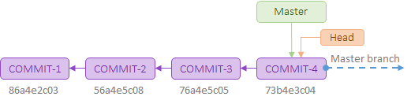
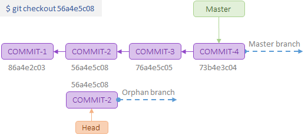
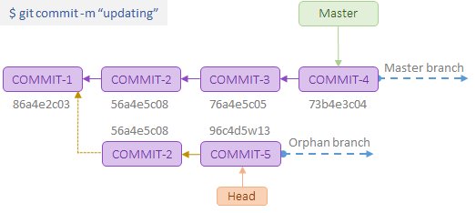

[Home](https://debbiswal.github.io/Tech-BITE/) \| [Back](https://debbiswal.github.io/Tech-BITE/#git)  

## Detached Head in Git

With the "git checkout" command, we determine which revision of our project we want to work on.  
Git then places all of that revision's files in our working copy folder.  

Normally, you use a branch name to communicate with "git checkout":  
```bash
$ git checkout development
```

However, we can also provide the SHA1 hash of a specific commit instead:  
```
$ git checkout 56a4e5c08
Note: checking out '56a4e5c08'.

You are in 'detached HEAD' state...
```  

This exact state - when a specific commit is checked out instead of a branch - is what's called a "detached HEAD".  

**Head at master branch**  
  


**Head Detached after doing checkout to a specic commit SHA1**  
  


**Detached head moved to new commit SHA1**  
  

**The problem with a detached HEAD**  
The HEAD pointer in Git determines our current working revision (and thereby the files that are placed in our project's working directory).  

Normally, when checking out a proper branch name, Git automatically moves the HEAD pointer along when we create a new commit.  
We are automatically on the newest commit of the chosen branch.

When we instead choose to check out a commit hash, Git won't do this for us.  
The consequence is that when we make changes and commit them, these changes do NOT belong to any branch.  

This means they can easily get lost once we check out a different revision or branch: not being recorded in the context of a branch, we lack the possibility to access that state easily (unless we remember the commit hash of that new commit...).  


**When a detached HEAD shows up ?**  
There are a handful of situations where detached HEAD states are common:  

* Submodules are indeed checked out at specific commits instead of branches.
* Rebase works by creating a temporary detached HEAD state while it runs.

Happy Learning :)

[Home](https://debbiswal.github.io/Tech-BITE/) \| [Back](https://debbiswal.github.io/Tech-BITE/#git)  
