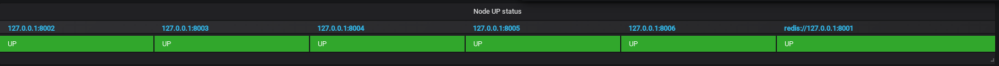
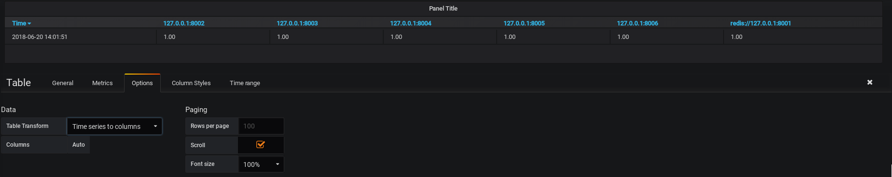
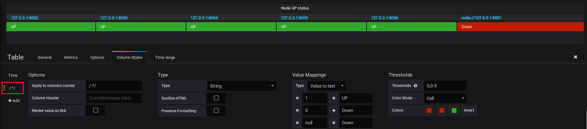

[Home](https://debbiswal.github.io/Articles/) \| [Back](https://debbiswal.github.io/Articles/#grafana)  

# Converting time series row data to column format using Table panel in Grafana  

**Requirement :** I have a Redis Cluster with 6 Redis instances running. I want to display which instance is running and which is not.
I am getting the below metrics from Prometheus for ‘redis_up’ key. The value for each instance also comes with label ‘addr’ and ‘alias’ , which are its IP/DNS and PORT details.

Below is the sample metrics :  
  

I want to display a dashboard like below :    
  

*Answer :*

**Which Pannel type I need to use ?**  
Create a panel of type ‘Table’
In ‘Metrics’ tab 
* Give PromQL as ‘redis_up’
* Check ‘Instant’ to get the current value for only 6 instances. Else you will get all records form past time also

The dashboard will look like below :  
   

**How to remove unnecessary columns?**  
* Set the ‘Format as’ to ‘Time Series’
* Set ‘Legend format’ as ‘{{addr}}’ , so that you will get only redis instance name like ‘127.0.0.1:8001’. Else you get value like ‘redis_up{addr="127.0.0.1:8006",alias="8006",instance="localhost:9121",job="redis_exporter"}’

Now You will get result like below :  
  

**How to convert row values to columns?**  
* Go to ‘Options’ tab 
* Set ‘Table Transform’ to ‘Time series to columns’

Now the dashboard will look like below with redis instances displayed in columns:  
  

**How do I remove the ‘Time’ column , which I don’t need ?**  
* Go to ‘Columns Styles’ tab
* Click on ‘Time’ sub tab (see the below image).
* Set the ‘Type’ as ‘Hidden’   
  

**How to display the message ‘UP’ or ‘DOWN’ with GREEN/RED background color ?**  
* Go to ‘Column Styles’ tab
* Click on ‘/.*/’ sub tab(see the below image). Basically this sub tab selects all columns depending on the regex pattern given.
* Set ‘Type’ to ‘String’ , so that we will be able to provide the messages based on values
* Provide the ‘Value Mappings’ as given in below screen
* In Thresholds I gave a range of 0 to 0.9 and changed the colors . You can change the colors by clicking on the given colors.
  * <0  means RED  
  * 0 to 0.9 means RED  
  * \>0.9 means GREEN   
* Set ‘Color mode’ to ‘Cell’ , so that color will be applied to Cell background.  

Now you will get the result like below  
Note that , the instance 127.0.0.1:8001 is not running(I stopped it to get the effect)  , hence it is coming as ‘DOWN’ with RED background color.  
  

Happy Learning :smiley:  

[Home](https://debbiswal.github.io/Articles/) \| [Back](https://debbiswal.github.io/Articles/#grafana)  
