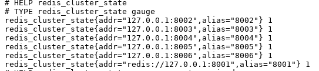
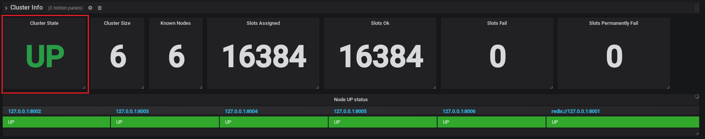
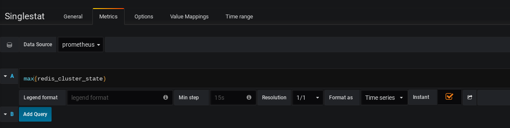
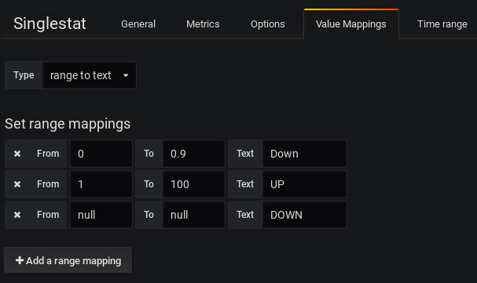

[:house:Home](https://github.com/debbiswal/Articles) | [Back](https://github.com/debbiswal/Articles/blob/master/README.md#grafana)

# Using SingleStat pannel in Grafana to diaplay messages based on value 

### Requirement :
I have 6 redis instances running with port 8001 to 8006 in cluster mode. I want to inform the user whether the Redis Cluster is UP or DOWN on the Grafana dashboard.  
I want to display a message ‘UP’ in Green color and ‘DOWN’ in Red color on Grafana dash board based on below metrics from Prometheus..  

Redis exporter metrics :  
  

These values will be either 0 (when cluster is DOWN) or 1(when cluster is UP).   
I want to display the message on dashboard like below :  
  

### Answer :

**What type of panel I will use ?**  
I am using SingleStat panel , which will show only one result.

**Setting the PromQL :**
Here I am trying to get the max() of redis_cluster_state , so that I will get a single value.  

Note that , I have checked the ‘Instant’ option , so that always I will get immediate value.Else the panel will be updated after completion of Quick ranges(like : Last 5 minutes…. etc) cycle  

I faced an issue where the dashboard is not getting updated until the Quick Range is completed. For me I have selected ‘Last 5 minutes’
  

**How to color the message (‘UP’ will be in Green , ‘DOWN’ will be in Red)**  
Set ‘Stat’ to ‘Current’ and change the ‘Font Size’ as required  
In Thressholds I gave a range of 0 to 0.9 and changed the colors . You can change the colors by clicking on the given colors.   
* <0  means RED
* 0 to 0.9 means RED
* />0.9 means GREEN 

By the above settings I will always get GREEN when the value is 1 , else RED  
  

**How to display the text ‘UP’ and ‘DOWN’ ?**  
Go to Value Mapings tab  
Select the Type as ‘range to text’ and provide the below ranges.   

You can see that there is an entry for ‘null to null’. By this I can show the message ‘DOWN’ when there is no metrics available from Prometheus(means all Redis instance is down , and Prometheus is not pulling any data for Redis)  
Note that , for ‘UP’ I have given the value ‘1 to 100’ , you can give any range will start value 1. I just need a range from 1 to anything.  
  

Happy Learning :smiley:  

[:house:Home](https://github.com/debbiswal/Articles) | [Back](https://github.com/debbiswal/Articles/blob/master/README.md#grafana)
