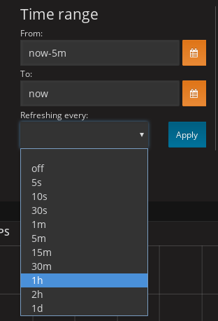
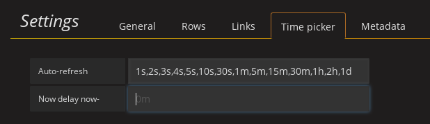

[:house:Home](https://github.com/debbiswal/Articles) | [Back](https://github.com/debbiswal/Articles/blob/master/README.md#grafana)

# How to set custom auto refresh values in Grafana  

By default  Grafana’s  auto refresh starts with minimum value of 5 second.  
What if you want to refresh the dashboard in custom made seconds. , say 1 second.  
  

**Solution :**  
Go to ‘manage dashboard’  
Go to ‘Settings’  
Click ‘Time picker tab’  
Set ‘Auto-refresh ‘  to ‘1s,2s,3s,4s,5s,10s,30s,1m,5m,15m,30m,1h,2h,1d’ => here we are adding 1s,2s,3s,4s , which were missing previously.  
  

Now go back to ‘Time range’ of dash board. You will get the custom refresh settings available there.
  

Happy Learning :smiley:  

[:house:Home](https://github.com/debbiswal/Articles) | [Back](https://github.com/debbiswal/Articles/blob/master/README.md#grafana)
