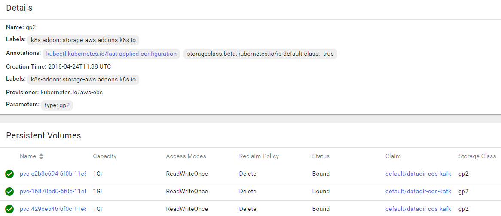

[Home](https://debbiswal.github.io/Articles/) \| [Back](https://debbiswal.github.io/Articles/#kubernetes)

# Resolving pending state of Persistent Volume Claim

I tried to create a PVC with default storage Provisioning.
But , it was always in ‘Pending’ state , and never recovered.

Below is the screen shot of my PVC yaml file:  
  

Upon investigation of my Storage class  , I figured out that the AccessMode of all the PV in default Storage Provisioner is ‘ReadWriteOnce’ .  

Below is the screen shot from default storage class (check the Annotation ‘is-default-class:true’) :  
  

After modifying the accesModes from ‘ReadWriteMany’ to ‘ReadWriteOnce’ , the PVC is successfully created.  
Please note that , I was ok with changing accessModes to ‘ReadWriteOnce’ , and it suffices my requirement.  

There could be other reasons for Pending state issue. So validate properly while resolving these kind of problems.  

Happy Learning :)  

[Home](https://debbiswal.github.io/Articles/) \| [Back](https://debbiswal.github.io/Articles/#kubernetes)
