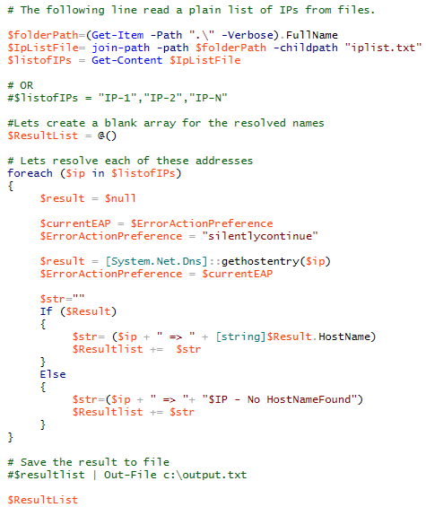

[Home](https://debbiswal.github.io/Articles/) \| [Back](https://debbiswal.github.io/Articles/#powershell)

## How to get HOST Name from IP  

Below is a powershell script which reads ip list from a file(iplist.txt) and displays the HOST name.  

Code :  

Happy Learning :)  

[Home](https://debbiswal.github.io/Articles/) \| [Back](https://debbiswal.github.io/Articles/#powershell)
