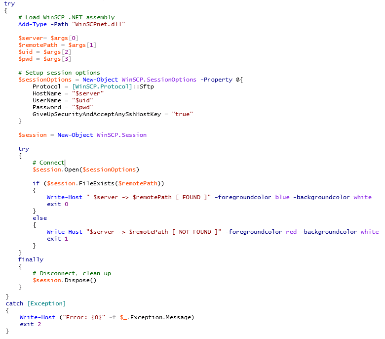

[Home](https://debbiswal.github.io/Articles/) \| [Back](https://debbiswal.github.io/Articles/#powershell)

## Validating copied files on Multiple servers using WinSCP with PowerShell script  

In my [previous article](https://github.com/debbiswal/Articles/blob/master/PowerShell/Art-2/copyfile_to_multiple_server.md) I have mentioned how to copy files to multiple Linux servers using WinSCP & Powershell script.
But how to confirm that files are actually copied.

*Note : You need to download the WinSCP automation(.Net assembly/COM library) dll from https://winscp.net/eng/download.php and keep it in the same folder where the script is kept.*  

Below script does that.  

* Create file with list of all servers , to which you want to copy  

*server_list.txt*  
```
LinuxServer1.tesco.org
LinuxServer2.tesco.org
LinuxServer3.tesco.org
```  

* Create the below Powershell script to validate whether a required file is present or not.  
*ValidateCopyFile.ps1*   
  

*Fileexists.ps1*  
  


Happy Learning :)

[Home](https://debbiswal.github.io/Articles/) \| [Back](https://debbiswal.github.io/Articles/#powershell)
