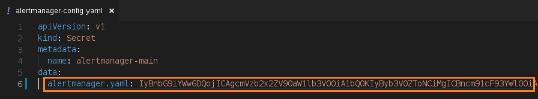
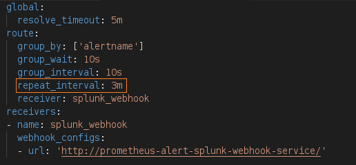
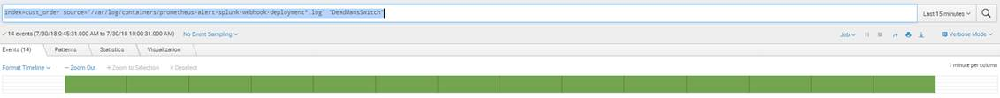

[:house:Home](https://github.com/debbiswal/Articles) | [Back](https://github.com/debbiswal/Articles/blob/master/README.md#prometheus-operator)

# How to change alerting interval of a Prometheus alert | Prometheus Operator

I have an alert ‘DeadMansSwitch’ configured in my Prometheus , which gets fired in every 3 minutes.  

Below image shows , how the alert looks like :  
  

The ‘DeadMansSwitch’ alert is configured without the ‘for:<time_duration>’ clause. The ‘for’ clause indicates to raise the alert after monitoring for the given time_duration.  

If ‘for’ clause is absent , it means , as soon as Prometheus evaluates the condition to be true , the alert is raised.  

(I know.. I know.. you might not be getting these terms like ‘for clause’ , ‘evaluation condition’ etc.. . But don’t worry , I will come back with another article explaining the details on How Prometheus alert rules firing works. So till then bear with me :smiley: )  

You can see from the below image (taken from Splunk) , that we are getting the log entry in every 3 minutes.  
  

My requirement was to get this alert in every 1 minute.  

So the question is :  

**How to repeat a Prometheus Alert in every 1 minute ?**  
Answer :
I tried with setting ‘for: 1m’ for the alert rule(just tried). But it did not work.
So looked for other solution . The solution lies within AlertManger configuration.

•	Open kube-prometheus/manifests/alertmanager/alertmanager-config.yaml
  

But , here you can see that  the entry alertmanager.yaml is encrypted .  The encryption is base64. This entry has the details of AlertManager configuration.

If we decode it using any base64 tool (I have used website https://www.base64encode.org/)  , we will be able to see the decoded alert manager configuration.

  

Here , we can see that the entry ‘repeat_interval’ is set to 3 minutes . This is the default setting for all the alerts.

Now , I want to set the repeat_interval to 1 minute  only for ‘DeadMansSwitch’ alert.
So I modified it , to override the ‘repeat_interval’ only for ‘DeadMansSwitch’.

   

In the above image , you can see that I have added a ‘routes’ section , where I specifically mentioned a match criteria for ‘DeadMansSwitch’ alert.

Again encode the configuration(used website https://www.base64encode.org/)  and put it in  kube-prometheus/manifests/alertmanager/alertmanager-config.yaml  file.

Deploy the alertmanager-config.yaml file.

Now , you can see that we are getting the alerts logged in Splunk in every 1 minute.

   

Happy Learning :smiley:

[:house:Home](https://github.com/debbiswal/Articles) | [Back](https://github.com/debbiswal/Articles/blob/master/README.md#prometheus-operator)
