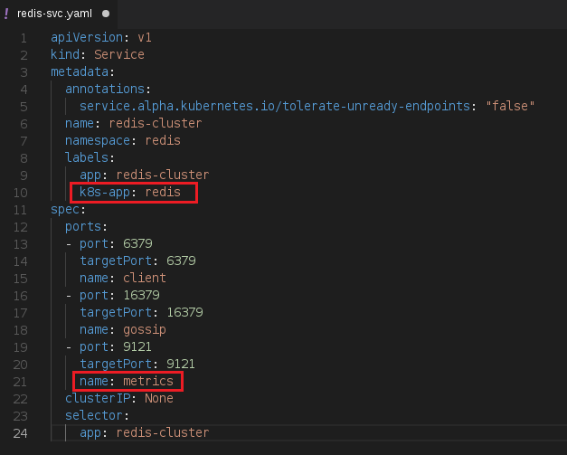
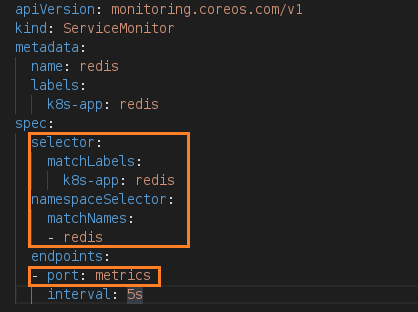

[Home](https://debbiswal.github.io/Tech-BITE) \| [Back](https://debbiswal.github.io/Tech-BITE/#prometheus-operator)

## How to scrape custom service metrics endpoints in Prometheus-Operator
We have a Service with name ‘redis-cluster’ running in ‘redis’ namespace in kubernetes .It exposes thee end points on port :   
*	6379 – Rredis client port (redis container)
* 16379 – Redis Cluster Bus (redis container)
* 9121 – Redis exporter(redis-exporter container) exposes Redis metrics(scraping the port 6379 on same pod)

We want the metrics exposed on port 9121 to be scrapped by Prometheus and will be available in Prometheus for future reference . So also we will use this data to draw graphs in Grafana.  

*Note : if you want to expose your custom metrics for your API , create an endpoint in your API , which will expose metrics data in Prometheus format.*  

**How to Steps :**

* Label the required service to be discoverable by Prometheus  
In order to , Prometheus  scrape our Redis-exporter metrics from end point 9121 , we first need to label our service , so that Prometheus will be able find it.  

  In below image , you can see that a label ‘k8s-app: redis’ is added. Remember that the label key should be ‘k8s-app’. 
Also the endpoint 9121 has been named as ‘metrics’.  
  

* Add RBAC role 
  * Open kube-prometheus/manifests/prometheus/prometheus-k8s-roles.yaml
  * Add the following (namespace should be ‘redis’)  
  

* Add RBAC Rolebindings
  * Open kube-prometheus/manifests/prometheus/prometheus-k8s-role-bindings.yaml
  * Add the following (namespace should be ‘redis’)  
  

* Add the ServiceMonitor(Custom Resource Definition , provided by Prometheus-Operator ) to monitor our ‘redis-cluster’ service.
  * Create a file kube-prometheus/manifests/prometheus/prometheus-k8s-service-monitor-redis.yaml
  * Add the below content.You can see that we are selecting namespace as ‘redis’ and label as ‘k8s-app:redis’ . Also the endpoint as ‘port:metrics’. In this way we are monitoring the endpoint 9121 of ‘redis-cluster’ service.  
    
  
  Now , our ‘redis-cluster’ service will be scrapped in every 5 seconds.  
  
Happy Learning :smiley:

[Home](https://debbiswal.github.io/Tech-BITE) \| [Back](https://debbiswal.github.io/Tech-BITE/#prometheus-operator)
