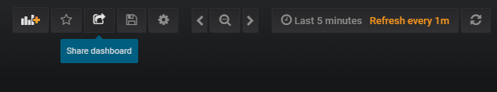
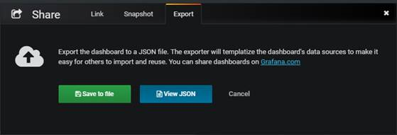
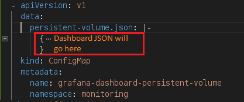
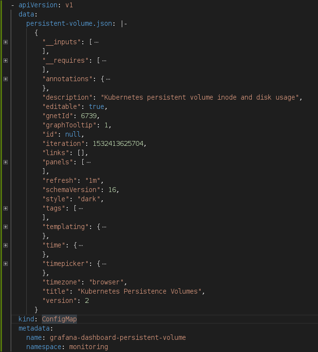

[Home](https://debbiswal.github.io/Tech-BITE) \| [Back](https://debbiswal.github.io/Tech-BITE/#prometheus-operator)

# How to deploy custom Grafana dashboard as part of Grafana Deployment in Prometheus Operator

The purpose of this article is to show , How to deploy custom Grafana dashboard as part of Grafana Deployment in Prometheus Operator.
So that , it will be available with the deployment and  You don’t have to create it  , after deploying Grafana.  

Here I am using a Dashboard , which I have created to monitor Persistent Volumes in Kubernetes  

* Open the required dashboard and click on ‘Share’ link from tool bar :  
  

* Go to ‘Export’ tab  
  

* Click on ‘View JSON’ button from ‘Export’ tab  
   

* Scroll down and remove the ‘uid’ entry from JSON . It will be automatically created when deployed.  
  

* Click on ‘Copy to Clipboard’
* Open a ‘NodePad’ and paste the copied JSON
  * Find and Replace ‘${DS_PROMETHEUS}’ with ‘prometheus’
  * Find and Replace ‘DS_PROMETHEUS’ with ‘prometheus’
  * Copy the modified JSON
* Now we need to indent it properly before using it :
  * Open  a JSON beautifier application like : https://codebeautify.org/jsonviewer
  * Paste the copied JSON(modified in previous step) in the left side text box
  * Click on ‘Beautify’ to get the properly formatted JSON in the right text box
  * You will get output like this   
    
  * Now , we need to indent it properly , in our case we need to indent the complete JSON 6 character space
  * Click on ‘Down arrow’ icon on line 1 , on right text box , to collapse the complete JSON into a single line like below :  
     
  * Now , select all the JSON by pressing CTRL+A or by selecting the data using mouse
  * And press ‘TAB’ key 3 times. Each tab makes 2 character space , so total 6 character spaces . Now it will look like this 
     
  * Now expand the JSON data by clicking on ‘1’. It will look like the below :  
     
   
* Go to kube-prometheus/manifests/grafana/grafana-dashboardDefinitions.yaml
  * Create the Dashboard Json entry , without putting the JSON(will be copied from Grafana)
    
  * Copy the formatted JSON(3 tab indented) and paste on the place  , marked in red rectangle
  * Now it will look like below :  
     
   
* Go to kube-prometheus/manifests/grafana/grafana-deployment.yaml
  * Under ‘volumeMounts’ section add :  
     
  * Under ‘volumes’ section add :  
    
  
* Now we need to Validate the complete YAML data
* Open any YAML validation site  like : https://codebeautify.org/yaml-validator
* Copy paste the yaml content from  grafana-dashboardDefinitions.yaml and validate . resolve it if any issue is there . Copy paste the validated yaml content to the respective file(if corrected) .
* Copy paste the yaml content from grafana-deployment.yaml and validate . resolve it if any issue is there. Copy paste the validated yaml content to the respective file(if corrected) .

DONE..  

Now , when you deploy  the Prometheus Operator , the Persistent Volume Dashboard will be available.  

*Note that : Any dashboard deployed as part of Grafana Deployment , is readonly. If you want to modify it , then you can save the modified  dashboard in a different name.*  

Happy Learning :)  

[Home](https://debbiswal.github.io/Tech-BITE) \| [Back](https://debbiswal.github.io/Tech-BITE/#prometheus-operator)
