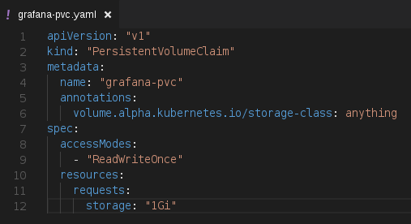
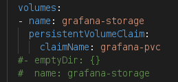
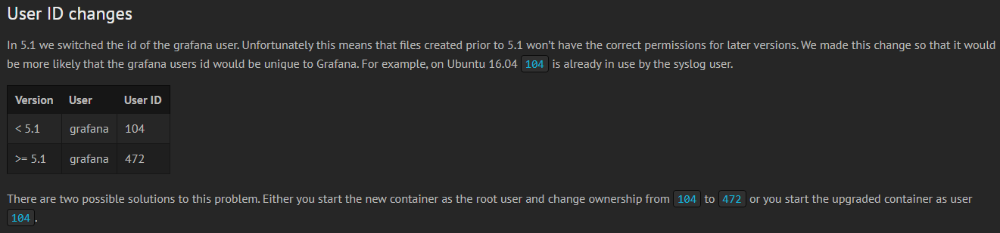
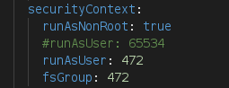

[:house:Home](https://github.com/debbiswal/Articles) | [Back](https://github.com/debbiswal/Articles/blob/master/README.md#prometheus-operator)

# How to deploy Grafana with Persistent Volume in Prometheus-Operator  

* Create the PVC for Grafana (grafana-pvc/grafana-pvc.yaml):  
  
Note that , I have used default dynamic volume provisioner . You can use your deployed PV.

* Use the ‘grafana-pvc’ in grafana deployment (grafana-deployment.yaml)  
 

You can see that I have commented the ‘emptyDir:{}’ , which is local storage , and used the ‘grafana-pvc’

By, doing this I was all set….  Deployed the Prometheus operator (teardown the existing setup , if exists)

But , alas…. Grafana pod was getting crashed.. Upon verifying the pod log I found below :
```shell
GF_PATHS_DATA='/var/lib/grafana' is not writable.
You may have issues with file permissions, more information here: http://docs.grafana.org/installation/docker/#migration-from-a-previous-version-of-the-docker-container-to-5-1-or-later
mkdir: cannot create directory '/var/lib/grafana/plugins': Permission denied
```
It clearly says , that there is some permission issue.

So , what to do now.

I followed the link given in the log , and got some information .
By default  , the user settings(grafana-deployment.yaml) for grafana is ‘runAsUser: 65534’.

**So what is UID 65534 ?**  
Ans: The UID 65534 is commonly reserved for nobody, a user with no system privileges, as opposed to an ordinary (i.e., non-privileged) user.

But if we want to use external storage , we have to use UID as 472 (I am using Grafana 5.2).  
 

* Setup the UID  


No that I have changed the ‘runAsUser’ to 472 and ADDED ‘fsGroup:472’

**What is fsGroup?**  
fsGroup defines a pod’s "file system group" ID, which is added to the container’s supplemental groups

* Change the /hack/cluster-monitoring/deploy’ file to include the PVC  


* Change the ‘/hack/cluster-monitoring/teardown’  


* Deploy the Prometheus Operator again..  

DONE… its working now  

Happy Learning :smiley:  

[:house:Home](https://github.com/debbiswal/Articles) | [Back](https://github.com/debbiswal/Articles/blob/master/README.md#prometheus-operator)
