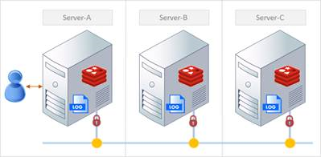
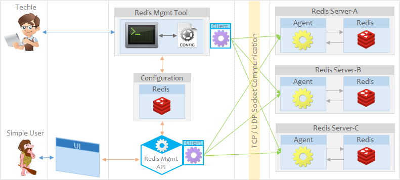
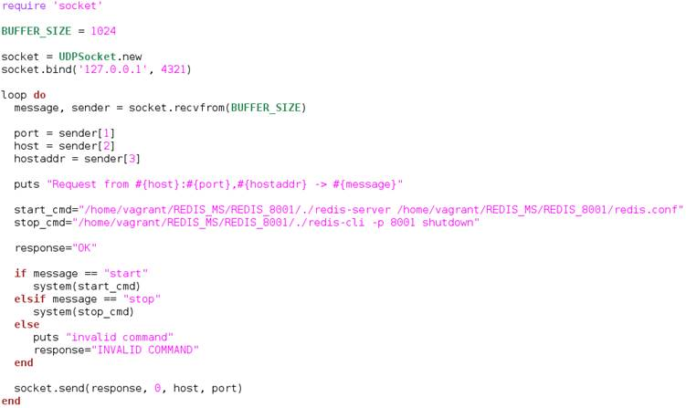
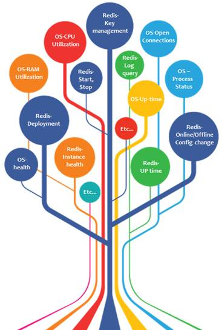

[Home](https://github.com/debbiswal/Articles)
# Agent the Saviour

Hi ,

Today I will discuss about a simple solution , for which I was beating around the bush.

**Problem statement**

*How to manage/monitor an application running on a remote server ?*  

To simplify this , just look at below diagram.  
 

In above diagram , we have 3 servers. On each server one application is running ,it is generating the log files.  
Suppose you logged-in into Server-A and you want to do the following things:  
* Being in Server-A , you want to look into the data of log files from Server-B and Server-C . 
* Being in Server-A , you will start or stop the application on Server-B and Server-C
* Being in Server-A , you will modify the config files of application on Server-B and Server-C.

As this scenario is for a Production environment , you can not directly access the application or log or config folders of Server-B/Server-C from Server-A(due to security).
So every time you have to log-in into Server-B or Server-C , to do the above mentioned tasks.

**Our problem** 

Just like the previously discussed problem , we have the same problem with REDIS implementation.  
Let me tell you what it is .  

We are using a light weight database known as REDIS for caching. This database is running on Linux server.  
So we have deployed 6 instances across 3 servers.  

In order to manage these Redis instances , We have developed a Redis Management tool(written in Shell script) , which does most of the things like : deployment, getting instance status , key details , and many more... .  

But only one problem with the tool is , by using this tool , we can not start a Redis instance from a different server. Every time we have to login to the corresponding server and start the instance.  

*One solution to this problem is :*  
* share a key file between all 3 Linux servers(one time job) 
* SSH(say : login) to remote server
* Do the required task
* logout from the target server

But due to security issues , we did not get the permission for deploying the key files.  

Even the Redis management tool has potentials but it has some other drawbacks :  
* In order to use this tool , user has to login to Linux production server.
* As the tool is a console application , it is not that user friendly.
* User should have knowledge on Linux basic commands
* Needs proper KT to user on how to use the tool
* Can not change config files of redis(few settings can only be changed offline)


With these drawbacks , a non-linux user is reluctant to use the tool.  

**So the question is :**  
*How can we make something simple which will be helpful to users , who does not know Linux ?*  
*Is it possible to modify the existing Redis management tool to do the start/stop tasks ?*  
*Is it possible to create a Dashboard , which will give me all the required information.I don’t have to login to every server for this?*

**Solution approach**  

The simplest solution is create an API which will connect to redis instance(by using any Redis library) and get the information.  

And this information will be used by a simple Web application to display the data. This solution will elevate many problems and attract non-Linux users to use it.  

But , still the same problem persists.  
We can not start a Redis instance from a remote server.  

So what to do? How to resolve this issue?....  

One fine day , I found a simple solution :  
* why not run an agent(an application which is like a windows service , which runs always) on every server on a predefined port.
* Access to this port from outside by any application or API.
* Send command to agent and agent will do the action

Let me explain you :    
Lets say we will put an agent on every server. The agent will run and listen to a certain port number.
Any data it reads from the port will be treated as a command to agent.
And when agent gets commands , it does the required action.

From API or Tool :  
* We will connect the agent port on remote server on which agent is running.
* send commands to agent port
* get the success/failure response from agent


**Architecture :**  
 

In above diagram , the Configuration DB and the config file will be used to provide the below information :  
* Agent details(hosted server , port)
* Redis instance details(hosted server ,port,deployment path,credentials etc..)

Non Linux users will use a web application , which will be like a dashboard. They will manage all the tasks from this web application.
Linux user will use Redis management tool.  

**Sample program :**  

The purpose of the sample program is to start and stop a Redis instance.  
The Redis instance is deployed in path ```/home/vagrant/REDIS_MS/REDIS_8001```  

To start the redis instance , we need to execute command(from REDIS_8001 folder) :  
```./redis-server redis.conf```  

To stop the redis instance , we need to execute command(from REDIS_8001 folder) :  
```./redis-cli –p 8001 SHUTDOWN```  

But if we want to execute the same command from any other folder , we have to provide the full path :  

To start the redis instance , we need to execute command(from REDIS_8001 folder) :  
```/home/vagrant/REDIS_MS/REDIS_8001/./redis-server /home/vagrant/REDIS_MS/REDIS_8001/redis.conf```  

To stop the redis instance , we need to execute command(from REDIS_8001 folder) :  
```/home/vagrant/REDIS_MS/REDIS_8001/./redis-cli –p 8001 SHUTDOWN```  

I will use two programs to demonstrate this by running on same machine.

*Agent* : 
* This program is the Agent application.
* It uses UDP socket and listens on port 4321.
* It will start the redis instance 8001 when it gets command *‘start’*
* It will stop the redis instance 8001 when it gets command *‘stop’*
* The commands are executed by using system() command in ruby
* Sends the response *‘OK’* to client for valid commands
* Sends the response *‘INVALID COMMANDS’* to client , if command is not start or stop

*Client* :
* The client takes one argument(start or stop) from command line
* Connects to agent running on same machine on port 4321 
* Sends the command to agent
* Close the connection

Below is the screenshot of the sample program .
The program is written in Ruby language(as we have Linux comes with pre-installed Ruby)

Please note that the below programs are not production ready . I am keeping it as simple as possible for better understanding.

**Agent.rb :**  

  

**Client.rb :**  

 

To run the program :
* Open a console , go to the folder where Agent.rb file is present
* Run Agent : ```ruby Agent.rb```
* Open a new console , go to the folder where Cgent.rb file is present
* Run Client to start the redis instance : ```ruby Client.rb start```
* Run Client to start the redis instance : ```ruby Client.rb stop```


**Things to consider to make it Production ready** 
* Define message format/protocol between Client and Agent
* Implement SSL socket programming for security
* Concurrent client handling by agent
* Non-blocking read – write
* Deciding Agent port number


**Endless Possibilities** 
We can develop the agent to do many tasks and get the data on to a centralized dashboard.
On exploring the agent , the Possibilities are Endless.  

 

Happy Learning :)
