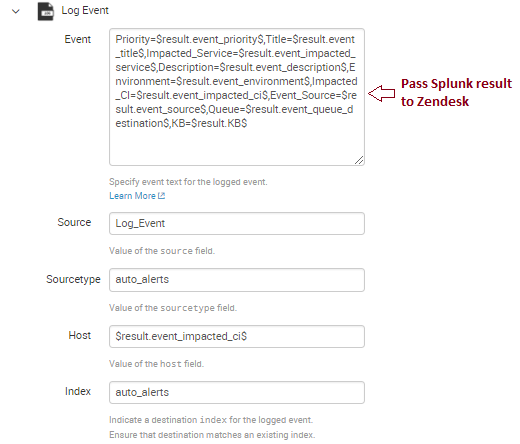

[Home](https://debbiswal.github.io/Tech-BITE) \| [Back](https://debbiswal.github.io/Tech-BITE/#splunk)

# Negative Alerting
**Context :** In our Kubernetes Cluster  , Prometheus Alert Manager is running . The sole purpose of AlertManager is to raise alerts based on the rules configured to it.
It also raises an Alert , known as ‘DeadMansSwitch’ in every 3 minutes  , to indicate that the complete alerting pipeline is healthy. 
So from and end user point of view  , this ‘DeadMansSwitch’ alert is the source of truth , of knowing the Alerting pipeline as healthy.

All the alerts raised by AlertManager is logged to Splunk (by using another application : AlertManger Logger).  
  

**Requirement :** Raise Zendesk ticket , when we are not getting a log with text ‘DeadMansSwitch’ in Splunk.  

**Solution :**

I started with the below  : =  

*Splunk Query :*
  

In the above query I am checking for the keyword “DeadMansSwitch”  . You can see that I am creating default values with ‘eval’ keyword. These default values will be passed to Zendesk.
And I will use an alerting condition , to check , if there is no record , then raise the alert.

*Splunk Alert Condition :*  
  

Configured the emails : to my mail id 

*Zendesk integration :*  
  

And tested the above Splunk alert by stopping the AlertManager Logger , so that no logs will come to Splunk.

After the configured scheduled time , I got the email , but did not get Zendesk ticket.

After beating around the bush , finally got the solution for this. The culprit was the Splunk query.

**So , Why I was not getting the Zendesk ticket ?**  
**Ans :** Its because , when the search query did not get any data like “DeadMansSwitch” , it met the alert condition and I got the email.But in order to raise Zendesk ticket , we should pass data to Zendesk. In my case , the search query was not get any data(which is valid) , when Alerting Pipeline fails , so no data was passed to Zendesk.

So , I need a kind of query , where I will get some result , with some indication that , there is no such record with data “DeadMansSwitch”.

So below the modified solution :

**Rectified Version :**  

*Splunk Query :*
  

Tested the above Splunk query and got the below result:  
  

*Splunk Alert Condition :*
I have to use custom condition  and check the ‘count’ as ‘0’.  
  

Now , again I tested the alert , and BINGO…..   
I got the email and Zendesk ticket.  

Happy Learning :)

[Home](https://debbiswal.github.io/Tech-BITE) \| [Back](https://debbiswal.github.io/Tech-BITE/#splunk)
