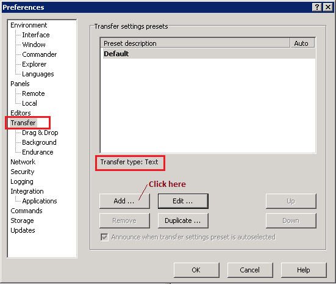
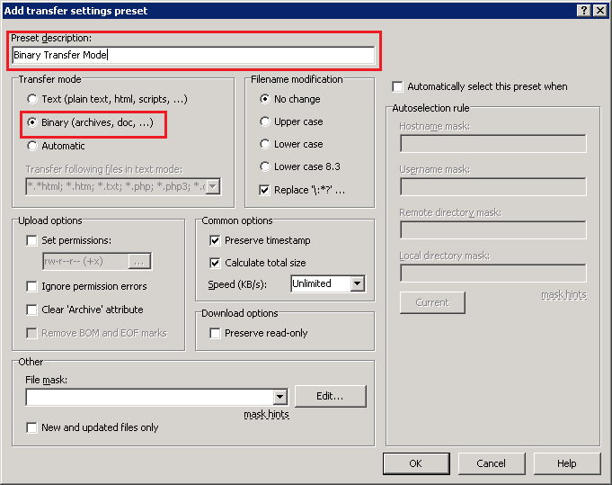
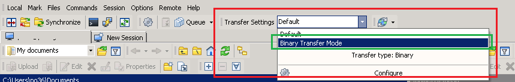

[:house:Home](https://github.com/debbiswal/Articles)  

## Binary mode in WinSCP

Hi ,  
Last week , I was trying to copy a zip file from Windows to Linux.  

But every time I copy , the zip file was getting corrupted.  

In order to test , whether the zip file was originally corrupted , I have download a fresh one from internet and tried. The result is same.  

So , I unzipped the files in windows and tried to copy the files to Linux.  

This time I found that , the executable files are corrupted , but any normal text file is not corrupted.  

So the conclusion was , copying any zipped file or any binary file(executable) in WinSCP , is getting corrupted.  

After some googling I found that I need to use BINARY transfer mode in WinSCP.  

And it nailed the issue.  

Below are the steps that you need to follow , while copying binary or zip(any compressed format like .tar , .tar.gz , .zip etc ) files using WinSCP.  

1)	From the toolbar , select Transfer Settings -> Configure  
  

2) You will get the Preference dialogbox  
  

Click the Transfer node from the Tree on the left side  

You can see that , the Default Transfer Type is Text.  

We need to add another Transfer type , which is Binary.  

Click on the Add … button  

3) You will get an ‘Add transfer settings preset’ dialog box  
 

Provide the Preset description . example : Binary Transfer Mode  
Select the Transfer mode as Binary.  
Click OK.  
You will go back to Preferences dialog box  
Click OK  

4) Now select the ‘Binary Transfer Mode’ from the Transfer Settings toolbar.  
  

5) Now copy your files.  

Happy Learning :smiley:  

[:house:Home](https://github.com/debbiswal/Articles)
